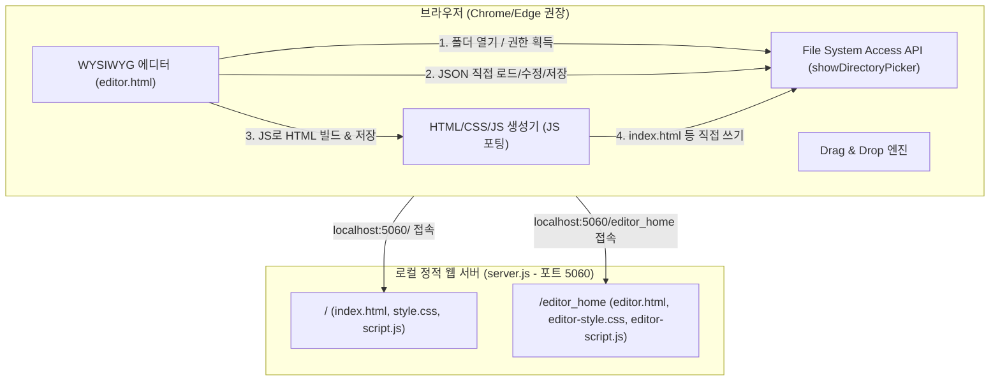

# 외래진료일정표 WYSIWYG 편집기 기능 사양서 (Feature Specification)

본 문서는 외래진료일정표를 시각적으로 편집하고, 이를 로컬 파일 시스템에 직접 저장 및 빌드하는 WYSIWYG 웹 에디터 및 뷰어의 설계 사양을 정의합니다.

## 1. 아키텍처 개요

시스템은 **순수 클라이언트-사이드 에디터 웹앱**과 **Express 기반 로컬 정적 웹 서버**의 구조로 동작합니다. 백엔드 API 호출을 전면 배제하고, 브라우저의 **File System Access API**를 사용해 로컬 파일을 직접 제어합니다.



| 구분 | 변경 사항 |
|---|---|
| **서버 역할** | API 엔드포인트 없음. 단순 정적 파일(에디터 및 빌드된 뷰어) 서빙 전용 웹서버 (포트 5060) |
| **파일 읽기 / 쓰기** | 브라우저 내에서 File System Access API를 통해 로컬 프로젝트 폴더를 열고, JSON 파일을 직접 읽고/수정하고/덮어씀 |
| **HTML 뷰어 빌드** | 기존 파이썬 스크립트 실행 API를 대신하여, **에디터 JS 내부에서 빌드 알고리즘을 수행**하여 `index.html`, `style.css`, `script.js`를 프로젝트 루트에 직접 저장 |
| **배포 방식** | 에디터 내 배포 기능은 제거됨. 사용자가 GitHub CLI (`gh`) 등을 이용해 프로젝트 루트에서 뷰어 구동에 필요한 파일들만 수동으로 푸시 |
| **빌드 디렉토리** | 기존의 `web_home` 디렉토리는 폐지되었으며, 빌드 결과물은 항상 **프로젝트 루트 디렉토리**에만 생성 |

---

## 2. 주요 기능 사양

### 2.1 WYSIWYG 드래그 앤 드롭 편집기
- **일정표 그리드**: 월요일부터 금요일까지, 오전/오후 시간대별로 구분된 테이블이 제공됩니다.
- **의사 배치 (Drag & Drop)**:
  - 좌측 의사 풀(Doctor Pool)에서 의사 카드를 선택해 특정 시간 셀로 끌어다 놓아 일정을 추가할 수 있습니다.
  - 기존에 표 내에 배치된 의사 칩(Chip)을 다른 셀로 끌어다 놓으면 해당 의사가 이동(Move) 처리됩니다.
  - 드래그 중 `Ctrl` (또는 Mac의 `Cmd`) 키를 누른 채 이동하거나 의사 풀에서 가져올 경우에는 복사(Copy)로 동작합니다.
- **의사 추가 및 제거**:
  - 사이드바에서 이름을 입력하여 의사 풀에 새로운 의사를 등록할 수 있습니다.
  - 배치된 의사 칩의 삭제(`x`) 버튼을 클릭하거나, 칩을 사이드바 하단의 **휴지통 영역 (Trash Zone)**으로 드랍하여 삭제합니다.

### 2.2 로컬 파일 시스템 직접 연동 (File System Access API)
- **프로젝트 폴더 열기**: 에디터 상단의 "폴더 열기" 버튼을 누르고 브라우저 파일 선택기에서 프로젝트 디렉토리(`KCCH-ClinicSchedule`)를 지정하여 읽기/쓰기 권한을 승인합니다.
- **파일 목록 자동 탐색**: 선택된 디렉토리 내에서 `clinic-schedule-*.json` 형태의 파일 목록을 자동으로 검색하여 파일 선택 드롭다운에 채웁니다. 기본 파일인 `clinic-schedule.json` 또는 가장 최신의 파일이 자동으로 로드됩니다.
- **JSON 저장**: 수정된 데이터를 `clinic-schedule-YYYYMM.json` 형식으로 해당 폴더에 직접 파일로 씁니다.

### 2.3 클라이언트-사이드 HTML 빌드
- **자동 빌드**: 에디터에서 "HTML 빌드" 버튼을 누르면, JS에 이식된 HTML 빌더 엔진이 `index.html`, `style.css`, `script.js` 콘텐츠를 생성합니다.
- **직접 파일 쓰기**: 생성된 3개 뷰어 파일을 프로젝트 루트 디렉토리에 직접 덮어씁니다.
- **뷰어 확인**: 빌드 후 즉시 `http://127.0.0.1:5060/` 경로를 통해 로컬에서 배포용 뷰어 화면을 테스트할 수 있습니다.

---

## 3. 설치 및 로컬 실행 방법

### 3.1 종속성 설치
로컬 정적 웹 서버 구동을 위해 Node.js 환경에서 다음을 실행합니다.
```bash
npm install
```

### 3.2 로컬 개발 서버 실행
```bash
npm run dev
```
실행 시 다음 주소로 접속 가능합니다:
- **에디터 (WYSIWYG)**: `http://127.0.0.1:5060/editor_home`
- **뷰어 (배포 확인용)**: `http://127.0.0.1:5060/`
