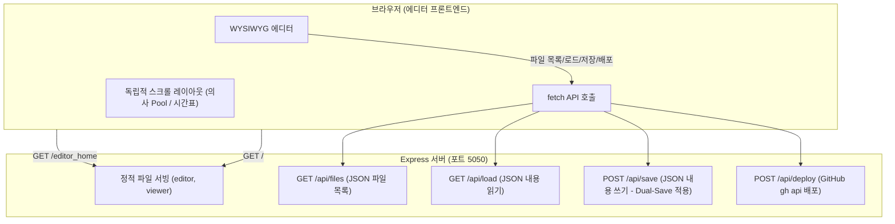

# 에디터 아키텍처 대폭 간소화: Express API 기반 자동 연동 에디터

## 배경
기존 에디터는 Vite + Express 2개 서버를 실행하는 복잡한 구조였습니다. 이를 대폭 간소화하고, 브라우저 보안 제약(CORS 및 로컬 파일 접근 문제)을 우회하면서 **서버 실행 폴더를 자동 인식하여 로드**할 수 있도록 Express API 기반 하이브리드 방식으로 구축하였습니다.
또한 브라우저에서 `5060` 포트가 Unsafe Port(SIP 차단)로 막히는 문제를 우회하기 위해 **5050 포트**를 사용하도록 조치했습니다.

## 최종 시스템 아키텍처

| 항목 | 기존 | 최종 구현 방식 |
|---|---|---|
| 서버 포트 | 3000(Vite) + 5060(Express) | **5050** (단일 Express 서버) |
| 폴더 지정 | 브라우저 showDirectoryPicker() 수동 지정 | **서버 구동 폴더 자동 인식 및 파일 스캔** |
| JSON 로드 | 수동 파일 선택 | 페이지 로드 시 **`clinic-schedule.json` 자동 로딩** |
| JSON 저장 | 클라이언트 측 로컬 직접 저장 | 서버 API (`POST /api/save`)를 통해 **`clinic-schedule.json` 및 `clinic-schedule-YYYYMM.json` 듀얼 저장** |
| HTML 빌드 및 배포 | Python 스크립트 API 호출 | **Deploy to GitHub** 버튼으로 변경, 서버 API (`POST /api/deploy`)를 통해 **gh api로 clinic-schedule.json 직접 푸시** |
| UI 레이아웃 | 스크롤 분리 안 됨 | **좌측 의사 Pool 패널과 우측 시간표 패널 각각 독립 스크롤** |

---

## 추가 요구사항 및 반영 이력

이 섹션은 프로젝트의 발전 과정과 추가 사용자 요구사항들을 지속적으로 추적 관리하는 용도입니다.

### [2026-06-21] 포트 오류 수정 및 단일 포트 5050 전환
- **요구사항**: 포트번호 5060 유지 및 처음 실행 시 index.html 빌드 불필요.
- **상황/문제**: 5060 포트는 크롬/사파리 등 브라우저 보안 규정상 **Unsafe Port**로 접속이 완전 차단되는 현상(`ERR_UNSAFE_PORT`) 발생.
- **해결책**: 브라우저 차단을 피할 수 있는 안전한 포트인 **5050 포트**로 변경하여 뷰어 및 에디터 서빙. 최초 실행 시 자동 빌드는 원하지 않는다는 의견에 따라 해당 로직 미적용.

### [2026-06-21] 패널 독립 스크롤 개선
- **요구사항**: 좌측 의사 Pool 패널과 우측 시간표 패널을 각각 독립 스크롤되도록 수정.
- **해결책**: `editor-style.css`에서 `body` 높이를 `100vh`로 고정하고 전체 스크롤(`overflow: hidden`)을 방지한 후, 작업 공간(`.workspace`)에 `min-height: 0`을 부여하여 좌측 사이드바와 우측 테이블 컨테이너가 각 영역 안에서 `overflow-y: auto`로 개별 스크롤을 갖도록 레이아웃 수정 완료.

### [2026-06-21] 서버 구동 폴더 자동 인식 및 자동 로딩
- **요구사항**: 서버를 실행할 때마다 서버가 구동 중인 로컬 폴더(스타트 폴더: `KCCH-ClinicSchedule`)를 브라우저에서 자동 인식하여 연결하고, 기본 파일(`clinic-schedule.json`)이 즉시 자동 로딩되도록 개선 요청.
- **해결책**: Express 백엔드에 파일 목록 제공(`GET /api/files`), 개별 로드(`GET /api/load`), 저장(`POST /api/save`), 파이썬 빌드 호출(`POST /api/build`) API들을 구현하고, 에디터 프론트엔드가 페이지 로드 즉시 이를 호출하여 연동하게끔 아키텍처 보완 완료.

### [2026-06-21] HTML 빌드 버튼 제거 및 GitHub 단일 파일 푸시(Deploy to GitHub) 추가
- **요구사항**: 동적으로 `clinic-schedule.json`을 읽도록 개선하여 뷰어 HTML 빌드 버튼이 무의미해졌으므로, 이 버튼을 `Deploy to GitHub`으로 교체하고 `gh` 명령어를 통해 `clinic-schedule.json` 파일만 저장소에 직접 푸시해주는 기능 요청.
- **해결책**:
  1. 에디터 UI(`editor.html`)에서 `HTML 빌드` 버튼명을 `Deploy to GitHub`으로 교체.
  2. 서버(`server.js`)에 `/api/deploy` API 구현.
     - `gh api repos/bcleemd/kcch-clinic-schedule/contents/clinic-schedule.json`을 이용해 원격 저장소의 파일 SHA 키를 동적 탐색.
     - 로컬 `clinic-schedule.json`의 전체 데이터를 base64 인코딩하여 `gh api --method PUT` API 요청으로 깃허브 원격 파일만 직접 업데이트(푸시).
  3. 에디터 스크립트(`editor-script.js`)에서 `/api/deploy` 연동 및 Toast 메시지 수정 완료.

### [2026-06-21] 듀얼 저장 기능 구현 및 작업 타겟 파일 유지
- **요구사항**: JSON 저장 시 `clinic-schedule.json`이 기본으로 업데이트되고 연월에 맞는 `clinic-schedule-YYYYMM.json` 백업 파일에도 동시 저장되도록 처리하되, 에디터 상에서 편집 중이던 활성 작업 파일 대상(`currentFileName`)이 백업 파일로 강제 변경되지 않도록 고정 요청.
- **해결책**:
  1. 서버의 `/api/save` API가 호출될 때, 전달받은 데이터를 `clinic-schedule.json`과 내부 날짜 메타데이터에 맞는 `clinic-schedule-YYYYMM.json` 두 곳 모두에 `fs.writeFileSync`를 실행하도록 이중 저장(Dual-Save)을 백엔드에 내장.
  2. 에디터 스크립트(`editor-script.js`)의 `saveJsonFile` 함수에서 저장 성공 후 `currentFileName = fileName` 대입 로직을 제거하여, 에디터의 활성 작업 타겟 파일이 항상 원본 `clinic-schedule.json`을 바라보며 끊김 없이 작업을 지속하도록 보완 완료.

### [2026-06-21] 월/수/금 컬럼 배경색 구분 개선
- **요구사항**: 월, 수, 금 컬럼에 가독성을 해치지 않으면서 화/목 컬럼(회색 계열)과 시각적으로 명확히 대비되는 배경색을 적용 요청.
- **해결책**:
  1. 뷰어용 `style.css`에서 `td.doctors:not(.highlight-col)` 선택자를 통해 월/수/금 컬럼을 저격하여, 오전(AM)에는 아주 연한 라임빛 `#f7fee7`, 오후(PM)에는 은은한 라임빛 `#ecfccb` 배경색을 적용.
  2. 에디터용 `editor-style.css` (어두운 테마)에서 동일하게 월/수/금 드롭존 영역에 아주 투명하고 은은한 청록/연두 광채(오전 `rgba(16,185,129,0.02)`, 오후 `0.04`)를 입혀, 가독성을 보존하며 화/목 컬럼과 고급스러운 대비를 형성함.

### [2026-06-21] 월/수/금 컬럼 배경색 대비 강화 및 Refinement
- **요구사항**: 월, 수, 금 컬럼의 배경 대비를 기존 라임/연두 톤보다 더욱 뚜렷하게 강조하여 시인성 제고.
- **해결책**:
  1. 뷰어용 `style.css`에서 월/수/금 컬럼 배경색을 파스텔 초록 계열로 한 단계 더 선명하게 강화. (오전: 부드러운 애플그린 `#d2e9c4`, 오후: 싱그러운 나뭇잎초록 `#b5dba0` 적용. 검은 글씨 등의 가독성 완벽 유지).
  2. 에디터용 `editor-style.css` (어두운 테마)의 월/수/금 드롭존 연두 광채 알파 값을 각각 `0.12`(오전), `0.16`(오후)로 대폭 상향하여 어두운 화면 내에서도 요일 구분을 확연히 제고함.

### [2026-06-21] 에디터 내 진료과 경계 구분선 강화
- **요구사항**: 에디터 테이블의 진료과 간 경계 구분선을 오전/오후 내부 구분선보다 더 진하고 굵게 처리 요청.
- **해결책**: `src/editor-style.css`에서 PM 행의 하단 테두리(`.pm-row td`) 스타일을 기존 `2px solid var(--border-glass)`에서 더 두껍고 밝은 흰색 반투명인 `3px solid rgba(255, 255, 255, 0.25)`로 변경하여, 진료과 블록 간의 경계 가시성을 대폭 상향함.
